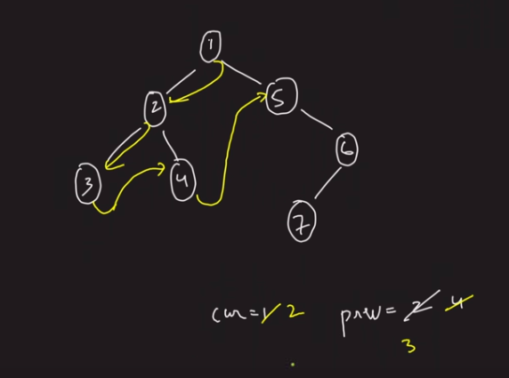

```cpp
// conect the tree to linked list
// form right left root traversal and make linked list of that


// TC - O(N)
// SC - O(N)
class Solution {
    TreeNode* prev = NULL;
public:
    void flatten(TreeNode* root) {
        if(root == NULL) return;

        flatten(root->right);
        flatten(root->left);

        root->right = prev;
        root->left = NULL;
        prev = root;
    }
};

// TC - O(N)
// SC - O(N)
// Iterative
class Solution {
public:
    void flatten(TreeNode* root) {
        // for the current node push its right then its left node
        // make left node as null
        // connect the top of stack node as right to current node
        if(root == NULL) return;
        stack<TreeNode*> st;
        st.push(root);
        while(!st.empty()) {
            TreeNode* cur = st.top();
            st.pop();

            if(cur->right != NULL) {
                st.push(cur->right);
            }
            if(cur->left != NULL) {
                st.push(cur->left);
            }
            if(!st.empty()) {
                cur->right = st.top();
            }
            cur->left = NULL;
        }

    }
};

// TC - O(N)
// SC - O(1)
class Solution {
public:
    void flatten(TreeNode* root) {
        TreeNode* cur = root;
        // similar to morris traversal but instead of connecting to the curr we connect to the curr->right and then connect curr->right to curr->left
		while (cur)
		{
			if(cur->left)
			{
				TreeNode* pre = cur->left;
				while(pre->right)
				{
					pre = pre->right;
				}
				pre->right = cur->right;
				cur->right = cur->left;
				cur->left = NULL;
			}
			cur = cur->right;
		}
    }
};
```
